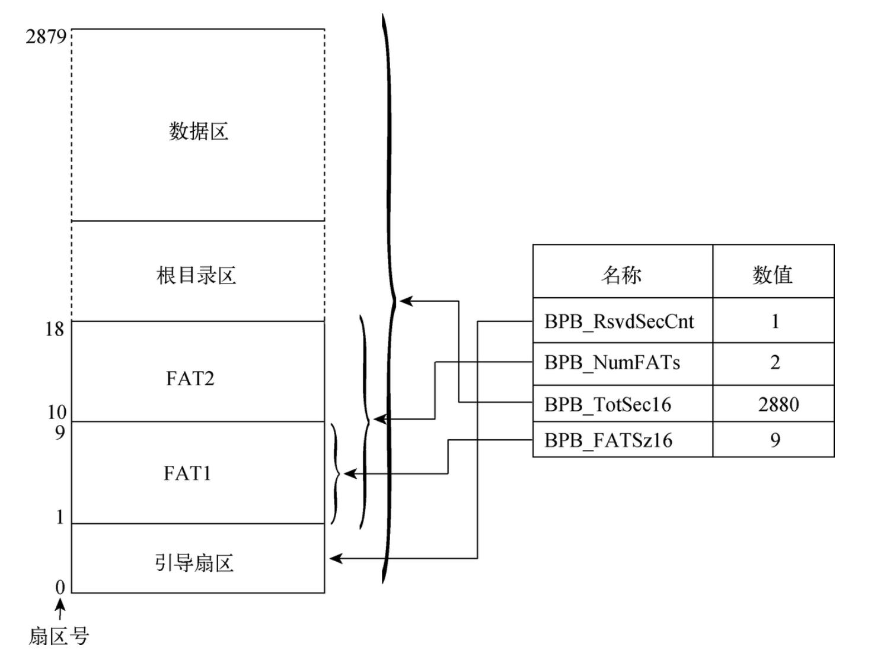

# 基础知识

## 系统异常处理

当处理器捕获到 异常/中断 时，便会根据 异常/中断 向量号从中断描述符表 IDT 索引出对应的门描述符，再由门描述符定位到处理程序的位置。如果向量号索引到了一个中断门或陷阱门，处理器就会向执行 `CALL` 指令访问调用门一样去执行 异常/中断 处理程序，*当程序来到内核代码的时候已经是在处理程序了*

中断/异常 的处理步骤如下：

1. 处理器会根据 中断/异常 向量号从中断描述符表 IDT 检索出对应的门描述符（中断门或者陷阱门）

2. 读取门描述符保存的段选择子，并从 GDT 或 LDT 中检索出处理程序所在的代码段，再根据门描述符记录的段内偏移确定处理程序的入口地址

3. 处理器在执行 中断/异常 处理程序的时候会检测处理程序所在代码段的特权级 `DPL`，并与当前代码段 `CPL` 进行比较

   - 如果 `CPL > DPL`，则会在执行处理程序之前切换栈空间

     - 处理器首先会强制将 `SS` 段寄存器赋值为 NULL 段选择子

     - 从 `TSS` 中读取 `RSP` 的值赋值给 `RSP` 寄存器

       - 如果 `IST` 位被置位，则从 `TSS` 中索引对应的 `IST` 栈指针

       - 如果 `IST` 位是复位的，则取出与  `DPL` 值相等的 `RSP` 赋值给 `RSP` 寄存器

       - > 关于 `IST`，`IST` 可以使得处理器无条件进行栈切换，`IST = 0` 时使用原有的栈切换机制，否则使用 `IST` 栈切换机制

     - 将 `SS` 和 `RSP` 作为处理程序的栈空间进行切换，在栈空间切换的过程中处理器将自动把切换前的 SS 和 RSP 值压入新的栈空间；处理器还会压入 `EFLAGS、CS、EIP` 寄存器的值到新的栈空间

     - 如果产生错误码，将其保存在新的栈空间内位于 `EIP` 之后（错误码必须由我们自己手动压栈和出栈，前面提到的其他几个寄存器由处理器负责）

   - 如果 `CPL = DPL`

     - 处理器会保存 `EFLAGS、CS、EIP` 到栈中
     - 如果异常产生错误码，则将其保存在异常栈内位于 `EIP` 寄存器之后

4. 执行 中断/异常 处理程序

5. 借助 `IRET` 指令从处理程序中返回，`IRET` 指令会还原之前由处理器保存的那些寄存器，如果此前发生过栈切换操作则会返回被中断的程序栈

> 关于门描述符，具体分为 *调用门描述符*、*任务门描述符*、*中断门描述符*、*陷阱门描述符*，任务门描述符这里不过多介绍现在都已经不再使用任务门描述符，调用门描述符现代 OS 也不常使用它只能存在于 GDT 或 LDT 中

中断门和陷阱门它们在 `IA-32e` 模式下它们的结构图如下。中断门和陷阱门的不同之处主要体现在 `IF` 标志位（`EFLAGS` 标志寄存器），穿过中断门的时候处理器会复位 `IF` 标志位，而穿过陷阱门的时候不会复位 `IF` 标志位。`IF` 标志位复位可以防止其它中断请求干扰当前中断处理程序

```c
/*  IA-32e 模式中所有系统段描述符都是 16B，保护模式只有 8B
// 127~64bit
Bit:     | 127              96| 95 							64|
Content: | 		  reserved      |   offset 63:32    |
// 63~32bit
Bit:     | 63              48 | 47 | 46 45 | 44 | 43 42 41 40 | 39 38 37 | 36 35 | 34 33 32 |
Content: | offset 31:16       | P  | DPL   | 0  |     TYPE    |  0  0  0 |  0  0 |    IST   |
// 31~0bit
Bit:     | 31              16 | 15              0 |
Content: | segment selector   | offset 15:00      |
*/
// 中断门的 TYPE = 1110，陷阱门 TYPE = 1111，系统调用 INT 0x80 就是使用中断门实现的
```

## TSS

> *`TSS` 保存不同特权级别下任务所使用的寄存器，特别重要的是 `esp`，因为比如中断后，涉及特权级切换时(一个任务切换)，首先要切换栈，这个栈显然是内核栈，那么如何找到该栈的地址呢，这需要从 `TSS` 段中得到，这样后续的执行才有所依托(在x86机器上，c 语言的函数调用是通过栈实现的)。只要涉及低特权环到高特权环的任务切换，都需要找到高特权环对应的栈，因此需要 `esp2`，`esp1`，`esp0` 起码三个 `esp`，**然而 linux 只使用 `esp0`***

intel 对于 `TSS` 的建议：为每一个进程准备一个独立的 `TSS` 段，进程切换的时候切换 `TR` 寄存器使之指向该进程对应的 `TSS` 段，然后在任务切换时(比如涉及特权级切换的中断)使用该段保留所有的寄存器。

linux 的做法：

1. linux 没有为每一个进程都准备一个 tss 段，而是每一个 cpu 使用一个 tss 段，tr 寄存器保存该段（tr 寄存器也是一个段寄存器）。进程切换时，只更新唯一 tss 段中的 esp0 字段，esp0 保存新进程的内核栈地址。
2. linux 的 tss 段中只使用 esp0 和 iomap 等字段，不用它来保存寄存器，在一个用户进程被中断进入 ring0 的时候，tss 中取出 esp0，然后切到 esp0，其它的寄存器则保存在 esp0 指示的内核栈上，而不保存在 tss 中。
3. 结果，linux 中每一个 cpu 只有一个 tss 段，tr 寄存器永远指向它。符合 x86 处理器的使用规范，但不遵循 intel 的建议，这样的后果是开销更小了，因为不必切换tr寄存器了。

`TR` 寄存器是一个段寄存器，它保存了 `16bit` 的段选择子以及当前段的属性，并且和 `cs` 等一样它也包含了两个隐藏的域 `base` 和 `limit`；使用 `LTR` 指令从选择子加载 `TSS` 段，`LTR` 指令从 `GDT` 中取出相应的 `TSS` 段描述符，把 `TSS` 段描述符的基地址和界限等信息装入 `TR`

`TSS` 段描述符的结构如下所示。这里说一下 `B(Busy)` 标志位，`TSS` 段描述符被加载到 `TR` 寄存器之后，其 `B` 标志位会被置位，此时如果重复加载此描述符将产生 `#TS` 异常

```c
/**
 * 127~64bit
 * Bit:     | 127              96| 95 							64|
 * Content: | 		  reserved     |     base 63:32     |
 *
 * 63~0bit
 * |   7    |     6       |     5     |   4    |   3    |   2    |   1    |   0    |  字节
 * |76543210|7 6 5 4 3210 |7 65 4 3210|76543210|76543210|76543210|76543210|76543210|  比特
 * |--------|-|-|-|-|---- |-|--|-|----|--------|--------|--------|--------|--------|  占位
 * |  BASE  |G|D|0|A|LIMIT|P|D |S|10B1|<------- BASE 23-0 ------>|<-- LIMIT 15-0 ->|  含义
 * |  31-24 | |/| |V|19-16| |P |
 *            |B| |L|     | |L |
 */
```

`TSS` 内存布局如下所示，其中的 `IST` 相关的由门描述符中的 `IST` 位指定；对比 保护模式 的 `TSS`，`IA-32e` 模式的 `TSS` 只需要负责不同特权级的切换工作


[浅谈tss - L (liujunming.top)](http://liujunming.top/2020/01/18/浅谈tss/)

## 特权级

有三种特权级类型：`CPL`, `DPL`, `RPL`，来帮助处理器检测执行权限

- `CPL`：`CPL` 描述了当前程序的执行特权级，它保存在 `CS` 或 `SS` 段寄存器的第 0 位和第 1 位。通常情况下 `CPL` 是正在执行的代码段的特权级，当处理器执行不同特权级的代码段时会修改 `CPL`，执行一致性代码段的时候 `CPL` 保持不变
- `DPL`：`DPL` 用于表示段描述符或者门描述符的特权级，它保存在段描述符或门描述符的 `DPL` 区域内。当处理器访问这两种描述符的时候会比较描述符中的 `DPL` 与段寄存器中的 `CPL` 以及段选择子中的 `RPL`
- `RPL`：`RPL` 是段选择子的重载特权级，用于确保程序有足够的权限去访问受保护的程序，它保存在段选择子的第 0 位和第 1 位。当 `RPL > CPL` 时 `RPL` 会覆盖 `CPL`，反之亦然

### 错误码

有些异常会产生错误码，标准错误码格式如下所示

```c
/**
 * Bit:     | 31              16| 15 							3|  2 |  1  |  0  |
 * Content: | 		reserved      | segment selector | TI | IDT | EXT |
 */
```

- EXT：该位被置位说明异常是在向程序投递外部事件的过程中触发
- IDT：该位被置位，说明错误码的段选择子部分记录的是中断描述符 IDT 内的门描述符，复位则说明记录的是 GDT/LDT 内的描述符
- TI：只有当 IDT 复位才有效，该位置位说明段选择子是 LDT 内的，复位说明是 GDT 内的

页错误异常的错误码比较特殊，其格式如下：

```c
/**
 * Bit:     | 31              5| 4 |  3 | 2 | 1 |0|
 * Content: | 		reserved     |I/D|PSVD|U/S|W/R|P|
 */
```

- P 标志位指示异常是否由一个不存在的页触发(P = 0)，或者进入了违规区域(P = 1)，或者使用保留位(P = 1)
- W/R 标志位指示异常是否由读取页(W/R = 0)或写入页(W/R = 1) 触发
- U/S 标志位指示异常是否由用户模式(U/S = 1)或超级模式(U/S = 0) 所产生
- RSVD 标志位指示异常是否由保留位所产生
- I/D 标志位指示异常是否由获取指令所产生

异常触发时 CR2 寄存器保存着触发异常的线性地址，异常处理程序可以根据此线性地址定位到页目录项和页表项

CS 和 EIP 寄存器指向了触发异常的指令，这两个寄存器会在触发异常的时候由处理器保存到栈上

# bootloader 引导程序

bootloader 引导程序分为 boot 程序和 loader 程序，boot 程序负责开机启动和加载 loader 程序；loader 程序则用于完成配置硬件工作环境、引导加载内核等任务

> 关于计算机上电 BIOS 的引导原理这里暂不讨论，参考 bzImage 和 boot 笔记

## boot

`boot` 程序位于软盘的第一个扇区，由 BIOS 加载到物理地址 `0x7c00` 处，`boot` 的一个重要的工作就是加载 `loader` 程序；为了加载 loader 程序，要么将 loader 放在固定的扇区，boot 每次都去加载该扇区的数据，但是这样会导致每次修改了 loader 并向存储介质写入都需要重新计算起始扇区和占用扇区数量。因此干脆直接将软盘格式化为 `FAT12` 文件系统，避免了每次都重新计算扇区的问题

> 格式化软盘为 FAT12，主要就是写入 FAT12 的引导扇区，类似于 ext2 文件系统的超级块；当我们在磁盘上初始化并写入了超级块的数据也就相当于将磁盘格式化成 ext2 文件系统了

FAT12 将存储介质划分成 引导扇区、FAT表、根目录区、数据区 四个部分



- **引导扇区**，描述了 FAT12 文件系统的相关结构信息以及我们的 `boot` 程序
- **FAT 表**，文件按照簇分割，每簇对应 FAT 表中的一个表项，通过 FAT 表可以将分割的文件连接起来，FAT12 的 FAT 表项为 12bit
- **根目录区**，存储目录信息
- **数据区**，文件的数据

首先需要为软盘创建 FAT12 文件系统的引导扇区数据，软盘的第一个扇区既包含了 FAT12 的引导扇区数据，也包含了 `boot` 程序的数据和指令；引导扇区的前 62 bytes 是作为 `super_block` 使用的，并且在一开始是一条跳转代码，这是因为其后面的数据不是可执行程序而是 FAT12 的组成信息，因此必须要跳过这部分内容

跳转代码会跳转到真正的 `boot` 程序

```assembly
  org 0x7c00
BaseOfStack     equ   0x7c00
BaseOfLoader    equ   0x1000
OffsetOfLoader  equ   0x00

RootDirSectors            equ   14    ; 定义了根目录占用的扇区数
SectorNumOfRootDirStart   equ   19    ; 定义了根目录的起始扇区号
SectorNumOfFAT1Start      equ   1     ; FAT1 表的起始扇区号
SectorBalance             equ   17    ; 减去两个 FAT 表之后的起始扇区，数据区从 FAT[2] 开始

; 填写 FAT 引导扇区前 62 bytes 的数据
jmp	short start
nop
BS_OEMName	db	'MINEboot'
BPB_BytesPerSec	dw	512
BPB_SecPerClus	db	1
BPB_RsvdSecCnt	dw	1
BPB_NumFATs	db	2
BPB_RootEntCnt	dw	224
BPB_TotSec16	dw	2880
BPB_Media	db	0xf0
BPB_FATSz16	dw	9
BPB_SecPerTrk	dw	18
BPB_NumHeads	dw	2
BPB_HiddSec	dd	0
BPB_TotSec32	dd	0
BS_DrvNum	db	0
BS_Reserved1	db	0
BS_BootSig	db	0x29
BS_VolID	dd	0
BS_VolLab	db	'boot loader'
BS_FileSysType	db	'FAT12   '
```

> 由于引导扇区会被 BIOS 加载到物理内存 0x7c00，所以需要为把该段程序的起始地址设置为 0x7c00

在创建了 FAT12 的引导扇区数据之后，需要为引导程序准备读取软盘的功能以用来加载 `loader` 和 内核；主要是借助 BIOS 中断完成读取软盘的操作

```assembly
; 封装 BIOS 中断，采用 0x13 中断（功能号 ah = 0x02）实现软盘扇区的读取操作
; @AL: 读入的扇区数，@CH: 磁道号的低 8bit
; @CL: 扇区号 1~63(bit 0-5), 磁道号的高 2bit(bit 6-7，只对硬盘有效)
; @DH: 驱动器号，ES:BX 表示数据缓冲区
Func_ReadOneSector:
  ; Func_ReadOneSector 参数
  ; @AX: 待读取的磁盘起始扇区号 ; @CL: 读入的扇区数量 ; ES:BX 表示目标缓冲区起始地址
  ; 另外由于 BIOS 中断只能根据 磁道/磁头/扇区 来读取扇区，
  ; 因此需要将 Func_ReadOneSector 的 LBA 格式转换成 BIOS 的 CHS 格式，具体公示如下
  ; Q = LBA 扇区号 / 每磁道扇区数，R = LBA 扇区号 % 每磁道扇区数，磁道号 = Q >> 1，磁头号 = Q & 1，起始扇区号 = R + 1
  push  bp        ; 保存栈帧寄存器
  mov   bp,   sp  ; 开辟 2bytes 的栈上空间
  sub   esp,  2
  mov   byte  [bp - 2], cl      ; 保存读入的扇区数
  push  bx
  mov   bl,   [BPB_SecPerTrk]
  div   bl          ; al = ax / bl, ah = ax % bl
  inc   ah          ; 起始扇区号
  mov   cl,   ah    ; 按照上述公式计算出磁道号与磁头号，并保存在对应的寄存器
  mov   dh,   al
  shr   al,   1
  mov   ch,   al
  and   dh,   1
  pop   bx
  mov   dl,   [BS_DrvNum]
Label_Go_On_Reading:
  mov   ah,   2     ; 调用 BIOS 中断读取软盘扇区
  mov   al,   byte  [bp - 2]  ; [bp - 2] 表示读入的扇区数，在前面保存的
  int   13h
  jc    Label_Go_On_Reading
  add   esp,  2     ; 恢复栈
  pop   bp
  ret
```

在拥有了软盘读取功能之后，便可以在其基础上实现文件系统的访问功能。

1. 通过根目录的起始扇区号，并依据根目录占用的磁盘扇区数来确定需要搜索的扇区数，从根目录中每次读入一个扇区的数据到缓冲区
2. 遍历读入缓冲区的每个目录项（其中目录项的长度事先已经知道）
3. 匹配目录项中的文件名和带查找的文件名
   - 发现带查找的文件
     - 根据 FAT 表项提供的簇号顺序依次加载扇区数据到内存中
   - 没有发现带查找的文件
     - 显示日志信息

具体的实现代码见 `boot.asm::Label_Search_In_Root_Dir_Begin ~ boot.asm::Label_Go_On_Loading_File`

> 另外关于在找到文件对应的目录项之后如何读取文件数据到内存：目录项指出了文件所在的第一个簇号（由于在我们这里一个簇就是一个扇区，所以后面都用扇区），根据文件的第一个扇区可以计算出它在 FAT 表中的位置 这是因为在 FAT 表中第 n 项对应第 m 个扇区一开始就已经确定了的 不管该项存的是哪个文件的数据，FAT 表项记录了该文件的下一个扇区号，下一个扇区号又可以计算该扇区在 FAT 表中的位置，因此只需要顺序跟着读取就好了

最后只需要一条段间跳转指令跳转到 loader 程序即可

```assembly
Label_File_Loaded:
  jmp   BaseOfLoader:OffsetOfLoader
```

## loader

`loader` 必须在内核程序执行前，为其准备好一切所需的数据，包括

1. 检测硬件信息
   - BIOS 自检出的大部分信息只能在实模式下获取，而且内核运行于非实模式下，所以必须要在进入内核之前将这些信息检测出来，再作为参数供内核使用；硬件信息主要是通过 BIOS 中断服务程序来获取和检测
2. 处理器模式切换
   - `实模式` -> `保护模式` -> `IA-32e 模式（长模式）`，在各个模式切换的过程中 loader 引导加载程序必须手动创建各运行模式的临时数据，并按照标准流程执行模式间切换
3. 向内核传递参数等
   - 传递控制信息，例如启动模式是 字符界面 还是 图形界面
   - 传递硬件数据信息，例如内存起始地址和内存长度

```assembly
org   0x10000
  jmp Label_Start

%include "boot/fat12.inc"		; FAT12 的引导扇区数据

; 最终内核的加载地址
BaseOfKernelFile  equ   0x00
OffsetOfKernelFile  equ   0x100000

; 临时内核空间，因为内核是通过 BIOS 中断来加载的，
; BIOS 是工作在实模式下的，只能访问低于 1MB 的地址
; 所以必须先将内核读入临时空间，再通过特殊方式搬运到 1MB 以上的地址
BaseTmpOfKernelAddr equ   0x00
OffsetTmpOfKernelFile equ 0x7E00

; 在内核搬运到 1MB 以上的地址之后，原来临时存储内核的空间就可以拿来作为其他用途
; 这里拿来保存内存结构数据，供内核程序在初始化的时候使用
MemoryStructBufferAddr  equ 0x7E00
```

> 由于 loader 会被加载到 `0x10000` 内存处，所以其起始地址是 `0x10000`

内核首先会被加载到 `0x7E00` 然后会被搬运到 `0x100000`，在内核加载完毕之后 `0x7E00` 就用来保存内存结构信息

### 加载内核

内核会被加载到 `0x100000` 地址处，但是由于实模式下只能寻址 1MB 以内的地址空间，因此为了突破这一限制首先需要开启 1MB 以上物理地址寻址功能；1MB 以上的寻址由 A20 地址线管理，机器上电时默认情况下 A20 地址线是关闭的，可是使用下列方法开启

- 操作键盘控制器
- A20 快速门，使用 I/O 端口 `0x92` 来处理 A20 地址线
- BIOS 中断 `int 0x15` 的主功能号 `AX = 2401` 可以开启 A20 地址线，功能号 `AX = 2400` 可以禁用 A20 地址线
- 读取 `0xee` 端口开启 A20 地址线，写入该端口则会禁用 A20 地址线

```assembly
; ======= 开启 1MB 以上的物理地址寻址（打开 A20 地址线）
  ; 首先开启 A20 地址线
  push ax
  in al, 0x92
  or al, 0x02
  out 0x92, al
  pop ax

  cli   ; 关闭中断

  ; 加载 GDT
  db 0x66
  lgdt [GdtPtr]

  ; 设置 CR0 寄存器的第 0bit 开启保护模式
  mov eax, cr0
  or eax, 1
  mov cr0, eax

  ; 设置段寄存器，然后关闭保护模式，这样可以使得在实模式下寻址范围超过 1MB
  mov ax, SelectorData32
  mov fs, ax
  mov eax, cr0
  and al, 11111110b
  mov cr0, eax

  sti
```

上面这段代码先开启了保护模式，然后设置了 段寄存器，再关闭了保护模式；这并不是多此一举的操作，这是因为在保护模式下设置段寄存器的时候会同时设置段基址和段限长这两个隐藏部分，而我们的 cpu 是不管实模式和保护模式的，它只使用 `段基址 + 偏移` 访问内存地址

所以在经过上述操作之后，cpu 的寻址能力就变成了 4GB 而不再局限于 1MB，下图是经历上述过程之后各寄存器的信息；可以看到 `fs` 寄存器的 `base` 和 `limit` 和其他寄存器不一样

```shell
00014040193i[BIOS  ] Booting from 0000:7c00
^C00196624559i[      ] Ctrl-C detected in signal handler.
Next at t=196624560
(0) [0x0000000100ce] 1000:00ce (unk. ctxt): jmp .-3 (0x000100ce)      ; e9fdff
<bochs:2> sreg
es:0x1000, dh=0x00009301, dl=0x0000ffff, valid=1
    Data segment, base=0x00010000, limit=0x0000ffff, Read/Write, Accessed
cs:0x1000, dh=0x00009301, dl=0x0000ffff, valid=1
    Data segment, base=0x00010000, limit=0x0000ffff, Read/Write, Accessed
ss:0x0000, dh=0x00009300, dl=0x0000ffff, valid=7
    Data segment, base=0x00000000, limit=0x0000ffff, Read/Write, Accessed
ds:0x1000, dh=0x00009301, dl=0x0000ffff, valid=1
    Data segment, base=0x00010000, limit=0x0000ffff, Read/Write, Accessed
fs:0x0010, dh=0x00cf9300, dl=0x0000ffff, valid=1
    Data segment, base=0x00000000, limit=0xffffffff, Read/Write, Accessed
gs:0x0000, dh=0x00009300, dl=0x0000ffff, valid=1
    Data segment, base=0x00000000, limit=0x0000ffff, Read/Write, Accessed
ldtr:0x0000, dh=0x00008200, dl=0x0000ffff, valid=1
tr:0x0000, dh=0x00008b00, dl=0x0000ffff, valid=1
gdtr:base=0x0000000000010040, limit=0x17
idtr:base=0x0000000000000000, limit=0x3ff
```

在完成 cpu 寻址范围的提升之后，就可以加载内核了，读取内核到内存的方法和读取 `loader` 程序一样，只不过这个时候文件名变成内核文件名了，这里不再赘述

读取内核特殊的点在于，我们是先把内核读取到 `0x7E00` 地址处，然后再移动到 `0x100000`；这是因为读取内核代码到内存是 BIOS 中断服务实现的而 BIOS 在实模式下只支持上限为 1MB 的物理地址寻址，所以必须先将内核程序读取到临时空间再通过特殊方式搬运到 1MB 以上的内存空间；具体实现代码如下所示

```assembly
; ======= 读取 kernel.bin 文件数据到内存中
Label_FileName_Found:
  mov ax, RootDirSectors
  and di, 0xFFE0
  add di, 0x01A
  mov cx, word  [es:di]
  push cx
  add cx, ax
  add cx, SectorBalance
  mov eax, BaseTmpOfKernelAddr
  mov es, eax
  mov bx, OffsetTmpOfKernelFile
  mov ax, cx
; 循环读取，读取的过程和读取 loader.bin 大致相同
; 区别在于 kernel.bin 需要移动到 0x100000
Label_Go_On_Loading_File:
  push	ax
	push	bx
	mov	ah,	0Eh
	mov	al,	'.'
	mov	bl,	0Fh
	int	10h
	pop	bx
	pop	ax
  mov cl, 1
  call Func_ReadOneSector
  pop ax
; 读取数据到 0x7E00，并移动到 0x100000. Begin
  push cx
  push eax
  push fs
  push edi
  push ds
  push esi
  mov cx, 0x200   ; 后面的 loop 指令重复次数，0x200 = 512Byte，刚好是一个扇区的大小
  mov ax, BaseOfKernelFile
  mov fs, ax
  mov edi, dword  [OffsetOfKernelFileCount]
  mov ax, BaseTmpOfKernelAddr
  mov ds, ax
  mov esi, OffsetTmpOfKernelFile
; 移动内核，采用一个字节一个字节移动
Label_Mov_Kernel:
  mov al, byte  [ds:esi]
  mov byte  [fs:edi], al
  inc esi
  inc edi
  loop Label_Mov_Kernel
  mov eax, 0x1000
  mov ds, eax
  mov dword [OffsetOfKernelFileCount], edi
  pop esi
  pop ds
  pop edi
  pop fs
  pop eax
  pop cx
; 读取数据到 0x7E00，并移动到 0x100000. End
```

> 注意这段代码中 fs 寄存器在突破寻址范围之后又被重新赋值了，这在 bochs 虚拟机下没有问题，但是在物理机上重新赋值后寻址范围会变回正常范围

在完成内核程序加载之后软盘驱动器就可以关闭了

### 物理地址信息获取

借助 BIOS 中断 `int 0x15` 可以获取物理地址空间信息，获取到的信息保存在之前的内核临时空间中，之后操作系统会获取该地址处的内存结构数组并解析它

具体的获取方式比较简单，大致过程如下：

```assembly
;=======   get memory address size type

    ……

    mov    bp,    StartGetMemStructMessage
    int    10h

    mov    ebx,   0
    mov    ax,    0x00
    mov    es,    ax
    mov    di,    MemoryStructBufferAddr

Label_Get_Mem_Struct:
  mov eax, 0x0E820        ; 0x15 中断的功能号，表示获取内存信息
  mov ecx, 20             ; es:di 指向地址的结构体大小
  mov edx, 0x534D4150     ; 对系统将要要求的系统映像信息进行校验，信息被 BIOS 放置在 es:di 所指向的结构中
  int 0x15                ; 中断号
  jc Label_Get_Mem_Fail   ; 中断执行失败的时候会设置 CF 标志位
  add di, 20              ; 递增 di，保存下一个内存结构
  
  cmp ebx, 0              ; 中断返回的时候会设置下一个地址范围描述符的计数地址，第一次调用或者内存探测完毕的时候是 0
  jne Label_Get_Mem_Struct
  jmp Label_Get_Mem_OK
```

### 显示模式设置

这部本是关于 `VBE` 的显示模式，通过设置不同的显示模式号可以配置出不同的屏幕分辨率、每个像素的数据位宽、颜色格式等，这些信息都可以从 `bochs` 虚拟平台的 `SVGA` 芯片获取

| SVGA 显示模式 | 列   | 行   | 物理地址  | 像素点位宽 |
| :------------ | :--- | :--- | :-------- | :--------- |
| 0x180         | 1440 | 900  | e0000000h | 32 bit     |
| 0x143         | 800  | 600  | e0000000h | 32 bit     |

具体的实现大致过程如下：

1. `AH = 0x4F，BIOS 0x10` 获取 SVGA Information
2. 使用 BIOS 中断获取 SVGA mode 并调用 `DispAL` 显示十六进制信息数据
3. 使用 BIOS 中断设置 SVGA mode

设置好显示模式之后可以观察到 bochs 虚拟机的窗口尺寸会发生变化

[DOS下的SVGA编程_u011423824的专栏-程序员宅基地 - 程序员宅基地 (cxyzjd.com)](http://www.cxyzjd.com/article/u011423824/45360119)；[INT 10, AH=4F - 极客分享 (geek-share.com)](https://www.geek-share.com/detail/2492944880.html)；

### 实模式 -> 保护模式 -> IA-32e 模式

首先需要从实模式进入保护模式，进入保护模式的契机是 **置位 CR0 寄存器的 PE 标志位**；在进入保护模式之前处理器必须在模式切换前，在内存中创建一段可以在保护模式下执行的代码和必要的系统数据结构

- 系统数据结构；必须创建一个拥有代码段描述符和数据段描述符的 `GDT`，并使用 `LGDT` 指令将其加载到 `GDTR` 寄存器
  - 对于栈寄存器 ss 可以使用数据段，无需创建专用描述符
- 中断和异常；在保护模式下 中断/异常 都由 IDT 来管理
  - 在处理器切换到保护模式之前，引导加载程序已使用 `CLI` 指令关闭外部中断，所以在切换到保护模式的过程中不会产生中断和异常，因此不必完整的初始化 GDT，只要有相应的结构体即可
- 分页机制；如果需要分页，则必须在开启分页之前在内存中创建一个页目录和页表，并将页目录物理地址加载到 `CR3` 寄存器
- 多任务机制；如果希望使用多任务机制或允许改变特权级，则必须在首次任务切换之前创建至少一个 `TSS` 结构和 `TSS` 段描述符

我们这里创建了 GDT 和 IDT 相关的数据结构，保护模式并没有开启分页，这是因为等下的 `IA-32e` 模式需要关闭分页并重新设置页表

```assembly
; ======= GDT
LABEL_GDT:  dd 0, 0
LABEL_DESC_CODE32:  dd 0x0000FFFF, 0x00CF9A00
LABEL_DESC_DATA32:  dd 0x0000FFFF, 0x00CF9200

GdtLen  equ $ - LABEL_GDT
GdtPtr  dw  GdtLen - 1
        dd LABEL_GDT
SelectorCode32  equ LABEL_DESC_CODE32 - LABEL_GDT
SelectorData32  equ LABEL_DESC_DATA32 - LABEL_GDT

; ======= tmp IDT
IDT:
  times 0x50  dq  0
IDT_END:
IDT_POINTER:
  dw  IDT_END - IDT - 1
  dd  IDT
```

创建好相关内核数据结构之后，Intel 官方给出的保护模式切换过程如下，具体顺序可以有所不同

1. 执行 `CLI` 指令禁止可屏蔽硬件中断
2. 执行 `LGDT` 指令将 GDT 的基址和长度加载到 GDTR 寄存器
3. 执行 `mov cr0` 指令置位 CR0 寄存器的 PE 位（可以同时置位 PG 标志位用来开启分页）
   - 如果开启分页，那么该条指令和后续的 `JMP/CALL` 指令必须位于同一性地址映射的页面内
4. 执行一条远跳转或远调用指令，以切换到保护模式的代码段去执行
   - 这里有两个作用，第一个作用是切换到保护模式之后代码段寄存器还是实模式下的，所以执行跳转指令之后会重新加载代码段寄存器
   - 第二个作用是刷新 cpu 的流水线
5. 如需使用 LDT，借助 `LLDT` 将 GDT 内的 LDT 段选择子加载到 LDTR 寄存器
6. 执行 `LTR` 指令将一个 `TSS` 段描述符的段选择子加载到 TR 寄存器
7. 进入保护模式之后数据段寄存器依然保存着实模式的段数据，因此必须重新加载数据段寄存器
8. 执行 `LIDT` 指令，将保护模式下的 IDT 表的基地址和长度加载到 IDTR 寄存器
9. 最后执行 `STI` 指令使能可屏蔽硬件中断

具体的实现如下，由于没有使用 LDT 和 TSS 所以不需要过多的步骤；完成下面这些操作之后 cpu 就进入了保护模式

```assembly
; ======= 初始化 IDT GDT 并进入保护模式
  cli       ; 关闭中断，所以在切换到保护模式的过程中不会产生外部中断

  db 0x66
  lgdt [GdtPtr]   ; 设置 GDTR 寄存器

; db 0x66
; lidt [IDT_POINTER]

  ; 开启保护模式
  mov eax, cr0
  or eax, 1
  mov cr0, eax

  jmp dword SelectorCode32:GO_TO_TMP_Protect  ; 刷新代码段寄存器为保护模式，刷新 cpu 流水线
```

当处理器进入保护模式之后，紧接着需要开启 `IA-32e` 64bit 模式，同样的在进入该模式之前需要准备好执行代码、必要的系统数据结构（GDT、IDT）以及设置好相关寄存器。进入 IA-32e 模式的契机是 `IA32-EFER` 寄存器的第 8bit 即 `LME` 标志位置位

官方给出的 `IA-32e` 模式初始化步骤如下：

1. 关闭分页机制
2. 置位 `CR4` 的 `PAE` 标志位，开启物理地址扩展功能
3. 将页目录加载到 CR3 寄存器
4. 置位 `IA32_EFER` 寄存器的 `LME` 标志位，开启 `IA-32e` 模式
5. 置位 `CR0` 的 `PG` 标志位重新开启分页，此时处理器会自动置位 `IA32_ERER` 寄存器的 `LMA` 标志位

在保护模式下首要任务是初始化各个段寄存器以及栈指针，然后检测处理器是否支持 `IA-32e` 模式，如果支持则开始向 `IA-32e` 模式切换，检测代码如下所示

```assembly
GO_TO_TMP_Protect:
; ======= go to tmp long mode
  mov ax, 0x10      ; 重新加载数据段寄存器，使其从实模式变成保护模式
  mov ds, ax
  mov es, ax
  mov fs, ax
  mov ss, ax
  mov esp, 0x7E00

  call support_long_mode
  test eax, eax           ; 对操作数进行 and 运算
  jz no_support           ; ZF(zero) 标志被置位则跳转

; ======= test support long mode or not
support_long_mode:
  ; 确定 cpu 支持的最大扩展功能号，返回结果也保存在 eax 中
  mov eax, 0x80000000
  cpuid
  cmp eax, 0x80000001         ; eax < 0x80000001 CF = 1，eax >= 0x80000001 CF = 0
  setnb al                    ; setnb 指令用于根据进位标志 CF 设置操作数 al。如果 CF = 1 则 al = 0，否则 al = 1
  jb support_long_mode_done   ; CF = 1 说明不支持 0x80000001 扩展功能，则跳转
  mov eax, 0x80000001
  cpuid
  bt edx, 29                  ; 把 edx bit29 传递给 CF 标志位，=1 说明处理器支持 IA-32e 模式
  setc al                     ; CF = 1 -> al = 1
support_long_mode_done:
  movzx eax, al
  ret
; ======= no support
no_support:
  jmp $
```

> 这里采用 CPUID 指令首先检测 cpu 所支持的最大扩展功能号，如果支持 0x80000001 的话 再采用该扩展功能执行 CPUID 指令，检测执行结果的 bit 29 如果是 1 就说明处理器支持 IA-32e 模式

完成了处理器模式检测之后，下一步需要为 IA-32e 模式配置临时页目录页页表，临时页表采用硬编码的方式，真正的页表会在内核代码里面重新设置；在这里我们使用的是 `2MB` 的页大小，因此只需要三级页表

```assembly
; ======= init temporary page table 0x90000
  ; 这里的页表是 IA-32e 模式的页表，页表项大小为 8B
  
  ; PML4
  mov	dword	[0x90000],	0x91007   ; 映射 0 地址开始的地址
	mov	dword	[0x90004],	0x00000
	mov	dword	[0x90800],	0x91007
	mov	dword	[0x90804],	0x00000

  ; PDPT
	mov	dword	[0x91000],	0x92007
	mov	dword	[0x91004],	0x00000

  ; PDT
	mov	dword	[0x92000],	0x000083
	mov	dword	[0x92004],	0x000000

	mov	dword	[0x92008],	0x200083
	mov	dword	[0x9200c],	0x000000

	mov	dword	[0x92010],	0x400083
	mov	dword	[0x92014],	0x000000

	mov	dword	[0x92018],	0x600083
	mov	dword	[0x9201c],	0x000000

	mov	dword	[0x92020],	0x800083
	mov	dword	[0x92024],	0x000000

	mov	dword	[0x92028],	0xa00083
	mov	dword	[0x9202c],	0x000000

  ; 后面不需要 PT 了，这是因为在 PDTE 里面的第 7bit 置为 1 了，
  ; 说明采用了 2MB 的页大小，所以不需要下一级页表了
```

随后只需要加载 GDT、打开 PAE（cr4 寄存器的第 5 位）、设置 CR3 寄存器为页目录的物理地址，最后打开 IA-32e 模式、开启分页功能，至此就完成了 IA-32e 模式的切换；最后只需要执行一条跨段 跳转/调用 指令，将 CS 段寄存器更新为 IA-32e 模式的代码段描述符

```assembly
; ======= enable long-mode
  mov ecx, 0x0C0000080
  rdmsr				; IA32_EFER 寄存器位于 MSR 寄存器组，使用 rdmsr/wrmsr 可以访问 64bit 的 MSR 寄存器
  						; EDX 存储 MSR 的高 32bit，EAX 存储 MSR 的低 32bit
  bts eax, 8
  wrmsr
```

PAE：[linux内存管理之PAE（物理地址扩展）解决内存大于4G的问题_jinking01的专栏-CSDN博客](https://blog.csdn.net/jinking01/article/details/105834801)

# 内核

## head.S

内核执行头程序负责为操作系统创建段结构和页表结构、设置某些默认处理函数、配置关键寄存器结构等工作，在完成上述工作之后通过远跳转指令进入内核主程序。

loader 程序将整个内核装载到物理内存地址 `0x100000` 处，`head.S` 位于该地址开始的起始位置，第一条指令的虚拟地址是 `0xffff 8000 0010 0000` 位于标签 `_entry` 由链接脚本指定。这里采用的页表是在 loader 程序里面设置好的页表，`0xffff 8000 0010 0000` 对应的 PML4 索引是 `0x0`，PDPT 索引是 `0x0`，PDT 索引是 `0x0`，页内偏移是 `1M`，所以最终映射到的物理地址是 `0x100000`

### GDT 初始化

head.S 的一个重要的工作就是重新设置 `GDT`、`IDT` 以及 `TSS`，它们都被都保存在 `.data` section，在这里只有 `GDT` 一开始就在内存写好了。关于 `GDT`，段描述符和段选择子的结构如下所示


在 `IA-32e` 模式下段描述符会忽略段基址和段长度，但是逻辑地址到线性地址的转换过程依然采用段基地址加段内偏移的方法，不过由于这两个值是被忽略的 被设置为 0，实际上一个段覆盖了整个线性地址空间（也称为平坦地址空间）

```c
// 段选择子（段寄存器）
Bit:     | 15                                3 | 2  | 1 0 |
Content: | offset (index)                      | ti | rpl |
// offset 表示在 GDT 中的索引
```

```assembly
/**
 * 定义 .data 段，
 * 存放 GDT, IDT, TSS, 页表 等数据
 */
.section .data

/* GDT_Table */
/**
 * .global 表示在符号表中标记该符号是一个全局符号
 * 链接器只能处理全局符号
 * 另外 GDT_Table 在这里只表示一个内存地址而已，在 C 中使用则会表示一个变量
 */
.global GDT_Table
GDT_Table:
  /* .quad 表示对于每个数，从当前位置开始分配 8-byte 存放 */
  .quad   0x0000000000000000    /* 0 NULL 描述符 */
  .quad	  0x0020980000000000    /* 1 KERNEL Code 64-bit, Segment 0x08 */
  .quad	  0x0000920000000000		/* 2	KERNEL Data	64-bit, Segment 0x10 */
	.quad	  0x0020f80000000000		/* 3	USER Code 64-bit, Segment 0x18 */
	.quad	  0x0000f20000000000		/* 4	USER Data	64-bit, Segment 0x20 */
	.quad	  0x00cf9a000000ffff		/* 5	KERNEL Code 32-bit, Segment 0x28 */
	.quad	  0x00cf92000000ffff		/* 6	KERNEL Data 32-bit, Segment	0x30 */
  .fill   10,8,0                /* fill repeat, size, value */
GDT_END:

GDT_POINTER:  /* 赋值给 GDTR 寄存器 */
GDT_LIMIT:    .word   GDT_END - GDT_Table - 1
GDT_BASE:     .quad   GDT_Table
```

在 `_start` 的开始我们先设置好 `GDTR` 和 `IDTR` 寄存器，由于 `GDTR` 被更新了所以需要重新加载段寄存器；`CS` 寄存器不能直接赋值更新，只能通过远跳转进行更新，这里有一个问题 `GAS` 编译器暂不支持直接远跳转 `JMP/CALL` 指令，所以我们采用 `LRET` 指令来模拟 `LJMP`，这将在完成页表更新后执行

```assembly
/* 加载 GDTR */
lgdt  GDT_POINTER(%rip)

/* 加载 IDTR */
lidt  IDT_POINTER(%rip)
mov   $0x10,  %ax
mov   %ax,    %ds
mov   %ax,    %es
mov   %ax,    %fs
mov   %ax,    %gs
mov   %ax,    %ss
mov   $0x7E00,  %rsp
```

### 页表初始化

这里首先简单描述一下 `IA-32e` 模式的页表的一些内容，实际上还有其他结构的页表比如 `PSE`, `PAE`, `IA-32` 页表等

> 值得一题的是 IA-32e 模式的页大小支持 4KB(2^12), 2MB(2^21), 3GB(2^30)，每增大一级页大小，少一级页表（一级页表的索引占 9bit）；关于程序中的页表，`IA-32e` 模式的页表可以看作 PAE 页表的扩充，将 `PDPT` 从 4 个表项扩展成 512 个，然后额外添加一个 `level-4` 页表 `PML4`
>
> 正常的 64bit 模式下的页表是有 4 级页表的，分别是 `PML4`, `PDPT`, `PDT`, `PT`，但是在我们这里没有 `PT` 页表了，这是因为如果在 `PDT` 页表的页表项中将第 7 bit 置位了那就说明开启了 `2MB` 的页大小；`2M = 2^21, 21 = 9 + 12` 刚好不需要 `PT` 页表索引的 9bit 了，所以也就不需要 `PT` 页表了 

OK，紧接着 `head.S` 需要做的是重新设置 cr3 寄存器，因此我们首先需要在内存中人工设置好页表。页表内容如下，相关解释都已经在注释中说明

```assembly
/** 
 * 定义 64-bit 页表，每个页表项大小为 8B
 * 对于单个地址来说只有低 48-bit 才能进行页表地址转换
 */
.align  8
.org    0x1000        /* 对应的虚拟地址是 (链接脚本指定的地址 + 0x1000) */
__PML4E:
  .quad   0x102007    /* 线性地址 0 对应的 PML4E */
  .fill   255, 8, 0   /* 填充 0x00-PML4E ~ 0xffff8...-PML4E 中间的 PML4E */
  .quad   0x102007    /* 线性地址 0xffff 8000 0000 0000 对应的 PML4E */
  .fill   255, 8, 0   /* 填充剩余的 PML4E */

.org    0x2000
__PDPTE:
  .quad   0x103003    /* 不管是高地址还是低地址，对应的 PDPTE 索引都是 0 */
  .fill   511, 8, 0   /* 填充剩余的 PDPTE */

/* PDE 的最后 8-bit 中的第 7-bit 都是 1，表示开启了 2MB 的 page size */
.org    0x3000
__PDE:
  /* 0x...0000 在 PDT 中的索引为 0x00 */
  .quad   0x000083    /* 映射前 10MB 的物理地址到 0x00 和 0xffff 8000 0000 0000 */
  .quad   0x200083
  .quad   0x400083
  .quad   0x600083
  .quad   0x800083
  /* 0x...a00000 在 PDT 中的索引为 0x05 */
  .quad   0xe0000083  /* 映射 0xe0000000 开始的 16MB 物理地址到 0xa00000 和 0xffff 8000 00a0 0000 */
                      /* 0xe0000083 物理内存对应的是帧缓存，用来在屏幕上显示颜色，帧缓存的每个存储单元对应一个像素 */
                      /* 这里的帧缓存由于之前在 loader 程序中设置过，每个像素点的颜色深度为 32-bit */
  .quad   0xe0200083
  .quad   0xe0400083
  .quad   0xe0600083
  .quad   0xe0800083
  .quad   0xe0a00083
  .quad   0xe0c00083
  .quad   0xe0e00083
  .fill   499, 8, 0   /* 填充剩余的表项 */
```

设置好页表之后只需要把页表的物理地址更新到 `CR3` 寄存器即可

```assembly
/* 设置 CR3 */
/**
* __PML4E 在本程序内的虚拟地址是 0xffff 8000 0010 0000 + 0x1000，
* 最终映射到的物理地址是 0x101000，所以把 0x101000 赋值给 CR3
*/
movq  $0x101000,  %rax
movq  %rax,   %cr3
```

最后通过模拟的远跳转更新代码段寄存器

```assembly
/**
 * 使用远跳转更新 cs 段寄存器
 * 由于 GAS 编译器暂不支持直接远跳转 JMP/CALL 指令，所以这里采用 lretq 来模拟 ljmp
 */
movq  switch_seg(%rip), %rax  /* rax 保存 switch_seg 地址的内容 */
pushq $0x08                   /* 保存段选择子 */
pushq %rax                    /* 保存函数调用时的返回地址 */
lretq                         /* 远跳转 弹出段选择子和地址 进行跳转，即 ljmp 0x08:rax */

/* 64-bit 模式代码 */
switch_seg:
  .quad   entry64
entry64:
  movq  $0x10,  %rax
  movq  %rax,   %ds
  movq  %rax,   %es
  movq  %rax,   %gs
  movq  %rax,   %ss
  movq  $0xffff800000007e00,  %rsp  /* 栈指针 */
```

### IDT 初始化

前面我们只是加载了 `IDT` 表的信息到 `IDTR` 寄存器，但是 `IDT` 现在还是空的。为了能够捕获异常在这里先设置一个默认的处理函数，该函数只负责打印 message 信息

具体的初始化步骤在注释中已经解释清楚了，这里提一下中断描述符，其结构如下所示。因此我们在初始化中断描述符的时候，其工作就是按照下面展示的结构进行对应的 bit 设置

```c
// 127~64bit
Bit:     | 127              96| 95 							64|
Content: | 		  reserved      |   offset 63:32    |
// 63~32bit
Bit:     | 31              16 | 15 | 14 13 | 12 | 11 10 9 8 | 7 6 5 | 4 3 | 2 1 0 |
Content: | offset 31:16       | P  | DPL   | 0  |    TYPE   | 0 0 0 | 0 0 |  IST  |
// 31~0bit
Bit:     | 31              16 | 15              0 |
Content: | segment selector   | offset 15:00      |
```

```assembly
/**
 * 初始化 IDT
 * 1. 设置 ignore_int 的中断描述符
 * 2. 将整个 IDT 的 256 个中断描述符都设置为上述描述符
 */
setup_IDT:	/* 初始化 ignore_int 中断描述符 */
  leaq  ignore_int(%rip), %rdx      /* 保存 ignore_int 到 rdx */
  movq  $(0x08 << 16),    %rax
  movw  %dx,  %ax                   /* 现在 rax 31~16bit 保存的是段选择子， 15~0bit 保存的是 ignore_int 地址的低 16bit */
  movq  $(0x8E00 << 32),  %rcx
  addq  %rcx, %rax                  /* 现在 rax 47~32bit 保存的是 0x8E00 标志位 */
  movl  %edx, %ecx                  /* ecx 保存 ignore_int 地址的低 32bit */
  shrl  $16,  %ecx                  /* ecx 保存 ignore_int 地址的 31~16bit */
  shlq  $48,  %rcx                  /* ecx 的 63~48bit 保存 ignore_int 地址的 32~16bit */
  addq  %rcx, %rax                  /* 现在 rax 63~48bit 保存 ignore 地址的 32~16bit */
  shrq  $32,  %rdx                  /* rdx 保存 ignore_int 地址的高 32bit */
  leaq  IDT_Table(%rip),  %rdi      /* IDT_TABLE 地址保存到 rdi */
  mov   $256, %rcx                  /* 下面的循环次数，256 也就是 IDT entry 的个数 */
rp_sidt:		/* 设置 256 个中断描述符，每个中断描述符 16B */
  movq  %rax,   (%rdi)              /* 第 i 此循环，设置第 i 个表项的低 8byte */
  movq  %rdx,   8(%rdi)             /* 设置第 i 个表项的高 8byte */
  addq  $0x10,  %rdi                /* rdi 指向下一个 entry */
  dec   %rcx                        /* 循环次数减一 */
  jne   rp_sidt                     /* 如果 rcx != 0 继续循环 */
```

### TSS 初始化

主要内容如下：

1. *人工设置好 TSS 段描述符，然后写入 GDT，TSS 段描述符占 16B*
2. *使用 ltr 指令从 GDT 加载该描述符到 TR 寄存器*

```assembly
set_TSS64:
  leaq  TSS64_Table(%rip),  %rdx    /* 保存 TSS64_Table 地址到 rdx */
  xorq  %rax,   %rax                /* 清空 rax */
  xorq  %rcx,   %rcx                /* 清空 rcx */
  movq  $0x89,  %rax                /* rax = 0x89 */
  shlq  $40,    %rax                /* rax = 0x0000 8900 0000 0000 */
  movl  %edx,   %ecx                /* ecx 保存 TSS64_Table 地址的低 32bit */
  shrl  $24,    %ecx                /* ecx 7~0bit 保存 TSS64_Table 的 31~24bit */
  shlq  $56,    %rcx                /* rcx 63~56bit 保存 TSS64_Table 的 31~24bit */
  addq  %rcx,   %rax                /* rax = 0x??00 8900 0000 0000，? 代表的是 TSS64_Table 的 31~24bit */
  xorq  %rcx,   %rcx                /* 清空 rcx */
  movl  %edx,   %ecx                /* ecx 保存 TSS64_Table 地址的低 32bit */
  andl  $0xffffff,  %ecx            /* ecx 保存 TSS64_Table 地址的 23~0bit */
  shlq  $16,    %rcx                /* rcx 39~16bit 保存 TSS64_Table 地址的 23~0bit */
  addq  %rcx,   %rax                /* rax = 0x??00 89?? ???? 0000，? 的意思和上述一样 */
  addq  $103,   %rax                /* 103 = 0x67，rax = 0x??00 89?? ???? 0067 */
  leaq  GDT_Table(%rip),  %rdi      /* rdi 保存 GDT_Table 的首地址 */
  movq  %rax,   64(%rdi)            /* GDT_Table 的第 8 个 entry 保存 rax 的值，实际上 rax 的值就是 TSS 段描述符 */
  shrq  $32,    %rdx                /* rdx 保留 TSS_Table 的高 32bit */
  movq  %rdx,   72(%rdi)            /* 第 9 个 entry 保存 TSS_Table 地址的高 32bit */

  mov   $0x40,  %ax                 /* ax 变成 TSS 段选择子，ax = 0000 0000 0100 0000，第 4bit 开始是索引号，刚好等于 8 */
  ltr   %ax                         /* 加载 TSS 描述符到 TR 寄存器 */
```

### 跳转到内核主程序

所有操作完成之后，最后利用 `LRET` 指令跳转到内核主程序

```assembly
	movq  go_to_kernel(%rip),   %rax
  pushq $0x08
  pushq %rax
  lretq
go_to_kernel:
  .quad Start_Kernel
```

## 屏幕显示

本内核提供了 `color_printk()` 函数用来格式化字符显示，该函数的主要逻辑如下：

1. 调用 vsprintf 解析格式化字符串，将最终需要显示的内容保存到 buf
2. 调用 putchar 通过设置像素点颜色在显示器上显示字符

关于 `vsprintf()`，它是用来解析格式化字符串的，通过遍历需要格式化的字符串 `fmt` 对每个字符进行判断来实现

`putchar()` 用来在屏幕像素上显示一个字符，一个字符的像素大小是 16 行 8 列：

1. 通过 font 获取预先设置好的 ASCII 矩阵信息，ASCII 矩阵描述了每个字符的矩阵信息
2. 检查该矩阵的每一个 bit，如果是 1 表示该像素显示，否则不显示
3. 针对像素是否显示，在帧缓存区设置像素的颜色信息

具体的实现方式见代码注释

## 异常初始化

### TSS 初始化

基础知识里面提到了再发生 异常/中断 的时候会根据门描述符特权级或 `IST` 标志位，在 `TSS` 中取出 `RSP` 设置栈指针，因此我们需要完成 `TSS` 的初始化，包括两部分

- `TR` 寄存器初始化
- `TSS` 段内容初始化

```assembly
/* head.S */
set_TSS64:
  /**
   * 这里主要是两个任务
   * 1. 人工设置好 TSS 段描述符，然后写入 GDT，TSS 段描述符占 16B
   * 2. 使用 ltr 指令从 GDT 加载该描述符到 TR 寄存器
   */
  leaq  TSS64_Table(%rip),  %rdx    /* 保存 TSS64_Table 地址到 rdx */
  xorq  %rax,   %rax                /* 清空 rax */
  xorq  %rcx,   %rcx                /* 清空 rcx */
  movq  $0x89,  %rax                /* rax = 0x89 */
  shlq  $40,    %rax                /* rax = 0x0000 8900 0000 0000 */
  movl  %edx,   %ecx                /* ecx 保存 TSS64_Table 地址的低 32bit */
  shrl  $24,    %ecx                /* ecx 7~0bit 保存 TSS64_Table 的 31~24bit */
  shlq  $56,    %rcx                /* rcx 63~56bit 保存 TSS64_Table 的 31~24bit */
  addq  %rcx,   %rax                /* rax = 0x??00 8900 0000 0000，? 代表的是 TSS64_Table 的 31~24bit */
  xorq  %rcx,   %rcx                /* 清空 rcx */
  movl  %edx,   %ecx                /* ecx 保存 TSS64_Table 地址的低 32bit */
  andl  $0xffffff,  %ecx            /* ecx 保存 TSS64_Table 地址的 23~0bit */
  shlq  $16,    %rcx                /* rcx 39~16bit 保存 TSS64_Table 地址的 23~0bit */
  addq  %rcx,   %rax                /* rax = 0x??00 89?? ???? 0000，? 的意思和上述一样 */
  addq  $103,   %rax                /* 103 = 0x67，rax = 0x??00 89?? ???? 0067 */
  leaq  GDT_Table(%rip),  %rdi      /* rdi 保存 GDT_Table 的首地址 */
  movq  %rax,   64(%rdi)            /* GDT_Table 的第 8 个 entry 保存 rax 的值，实际上 rax 的值就是 TSS 段描述符 */
  shrq  $32,    %rdx                /* rdx 保留 TSS_Table 的高 32bit */
  movq  %rdx,   72(%rdi)            /* 第 9 个 entry 保存 TSS_Table 地址的高 32bit */

  mov   $0x40,  %ax                 /* ax 变成 TSS 段选择子，ax = 0000 0000 0100 0000，第 4bit 开始是索引号，刚好等于 8 */
  ltr   %ax                         /* 加载 TSS 描述符到 TR 寄存器 */
```

```c
// file gate.h
/* 配置 TSS 段内的 RSP 和 IST 项 */
void set_tss64(unsigned long rsp0, unsigned long rsp1, unsigned long rsp2,
               unsigned long ist1, unsigned long ist2, unsigned long ist3,
               unsigned long ist4, unsigned long ist5, unsigned long ist6,
               unsigned long ist7) {
  *(unsigned long *)(TSS64_Table + 1) = rsp0;
  *(unsigned long *)(TSS64_Table + 3) = rsp1;
  *(unsigned long *)(TSS64_Table + 5) = rsp2;

  *(unsigned long *)(TSS64_Table + 9) = ist1;
  *(unsigned long *)(TSS64_Table + 11) = ist2;
  *(unsigned long *)(TSS64_Table + 13) = ist3;
  *(unsigned long *)(TSS64_Table + 15) = ist4;
  *(unsigned long *)(TSS64_Table + 17) = ist5;
  *(unsigned long *)(TSS64_Table + 19) = ist6;
  *(unsigned long *)(TSS64_Table + 21) = ist7;
}
// file main.c
set_tss64(0xffff800000007c00, 0xffff800000007c00, 0xffff800000007c00,
            0xffff800000007c00, 0xffff800000007c00, 0xffff800000007c00,
            0xffff800000007c00, 0xffff800000007c00, 0xffff800000007c00,
            0xffff800000007c00);
```

### 门描述符初始化

采用内嵌汇编的方式，在 IDT 中设置对应向量号的门描述符，例如需要设置 page fault 的中断处理函数（page fault 的向量号是 14），那么需要在 IDT 的第 14 个 entry 设置好相关的 bit 即可

```assembly
/**
 * @gate_selector_addr: IDT 中的某一个 entry
 * @attr: 0x8E 或 0x8F
 * @ist: 见 set_xxx_gate 函数说明
 * @code_addr: 处理函数地址
 * 
 * 这里的匹配约束例如 "3", "2" 表示该变量的约束和 %3, %2 变量的约束一样
 */
#define _set_gate(gate_selector_addr, attr, ist, code_addr)                    \
  do {                                                                         \
    unsigned long __d0, __d1;                                                  \
    __asm__ __volatile__("movw   %%dx,   %%ax    \n\t"                         \
                         "andq   $0x7,   %%rcx   \n\t"                         \
                         "addq   %4,     %%rcx   \n\t"                         \
                         "shlq   $32,    %%rcx   \n\t"                         \
                         "addq   %%rcx,  %%rax   \n\t"                         \
                         "xorq   %%rcx,  %%rcx   \n\t"                         \
                         "movl   %%edx,  %%ecx   \n\t"                         \
                         "shrq   $16,    %%rcx   \n\t"                         \
                         "shlq   $48,    %%rcx   \n\t"                         \
                         "addq   %%rcx,  %%rax   \n\t"                         \
                         "movq   %%rax,  %0      \n\t"                         \
                         "shrq   $32,    %%rdx   \n\t"                         \
                         "movq   %%rdx,  %1      \n\t"                         \
                         : "=m"(*((unsigned long *)(gate_selector_addr))),     \
                           "=m"(*(1 + (unsigned long *)(gate_selector_addr))), \
                           "=&a"(__d0), "=&d"(__d1)                            \
                         : "i"(attr << 8), "3"((unsigned long *)(code_addr)),  \
                           "2"(0x8 << 16), "c"(ist)                            \
                         : "memory");                                          \
  } while (0)
```

### 异常处理函数

当处理器来到异常处理函数的时候，栈已经切换到异常栈了并且 `EFLAGS, CS, EIP` 都已经保存完毕

限于篇幅，异常处理函数的逻辑功能如下

1. 压入错误码和逻辑处理函数的地址（对于会产生错误码的异常，处理器会压入错误码；不会产生错误码的异常，人工压入 0）
2. 保存剩余的寄存器
3. 从栈上取出错误码和栈顶指针以及逻辑处理函数地址，跳转到逻辑处理函数

这里展示 `divide_error` 处理函数的逻辑

```c
/* 0 #DE. 除法错误 */
void do_divide_error(unsigned long rsp, unsigned long error_code) {
  unsigned long *p = NULL;
  p = (unsigned long *)(rsp + 0x98); /* 0x98 是 RIP 相对于 RSP 的栈上偏移 */
  /* 显示错误码值、栈指针值、异常产生的程序地址等日志信息 */
  color_printk(RED, BLACK, "do_divide_error(0), ERROR_CODE: %#018lx, RSP: %#018lx, RIP: %#018lx\n", error_code, rsp, *p);
  while(1);
}
```


# 参考

[指令集文档](https://faydoc.tripod.com/cpu/setnb.htm)；[汇编语言--x86汇编指令集大全 - 知乎 (zhihu.com)](https://zhuanlan.zhihu.com/p/53394807)

[ARM架构下常用GNU汇编程序伪指令介绍（Assembler Directive）_Roland_Sun的专栏-CSDN博客_gnu伪指令](https://blog.csdn.net/Roland_Sun/article/details/107705952)

